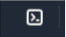

### AWS Cookbook - 1.4 Testing IAM Policies with the IAM Policy Simulator

Today, our goal is to create an IAM Role, attach an IAM Policy to said Role, and then simulate actions to verify the privileges granted by the role work as intended. 

It's never a good idea to constantly have administrative permissions. Instead, we need to consider the concept of least privilege, only having the permissions necessary to do a job and no more. When we need additional permissions in AWS, this is where IAM Roles come into play. IAM Roles can have permissions attached, known as an IAM Policy. With the ability to assume a role, we as users can use these roles to elevate our permissions, allowing us to perform actions we wouldn't be able to with our regular account. 

###### -- Workflow -- 


### Step 1 - Create an IAM Trust Policy

So, the first thing we need to do is create an IAM Trust Policy. We'll later attach this to an IAM Role that we'll be making. The Trust Policy, in this case, will allow EC2 to assume that IAM Role. Save the below JSON into a file called **assume-role-policy.json**.
```
{
  "Version": "2012-10-17",
  "Statement": [
    {
      "Effect": "Allow",
      "Principal": {
        "Service": "ec2.amazonaws.com"
      },
      "Action": "sts:AssumeRole"
    }
  ]
}
```

### Step 2 - Upload Trust Policy to the AWS CloudShell

Now we're going to upload that Trust Policy into our AWS CloudShell. All you need to do is log in to the AWS Console, and at the top right, you'll find a small box that looks like this.



You're welcome to use AWS CLI from your local machine; it's the same thing. However, CloudShell is handy since you don't have to worry about plaintext credentials sitting on your local machine, as is the case with AWS CLI. There are ways around this, but that's for another time. 

Once you've clicked the CloudShell icon, follow the below screenshots. When down, we'll type ```ls``` and see our file uploaded. 


Some things to keep in mind, CloudShell is Region-specific. That means if you change Regions, your files will not follow you. Additionally, files can be a max of 1Gb in size, and CloudShell can only hold a maximum of 1Gb worth of data.  

### Step 3 - Create IAM Role and Attach Trust Policy

Next, we're going to create an IAM Role. Within CloudShell type ```aws iam create-role --assume-role-policy-document \
     file://assume-role-policy.json --role-name AWSCookbook104IamRole```

You're welcome to name the Role whatever you'd like; just remember what it is. That *assume-role-policy* is the Trust Policy we created earlier. AWS sometimes uses different terminology between its CLI and the web console for some reason. 

Once you've run that command, you'll see an output similar to the below.


Curious about what we did? Check it out in your AWS Console. 


There's that Trust relationship I mentioned earlier ^^^.

### Step 4 - Attach an IAM Policy to our IAM Role

Our next step is attaching an IAM Policy to our newly created IAM Role. The IAM Policy is what gives our IAM Role privileges. Type this into CloudShell ``` aws iam attach-role-policy --role-name AWSCookbook104IamRole --policy-arn arn:aws:iam::aws:policy/AmazonEC2ReadOnlyAccess ```

If you're curious about **AmazonEC2ReadOnlyAccess**, that's an existing policy created by AWS. You can view it in the console, see what privileges it grants, and copy the ARN if needed. Ideally, we would make our own policy granting only the privileges we need, but this works for this lab. Since it's read-only, we won't be able to cause any "damage," nor do we have anything sensitive this Role could access.


### Step 5 - Testing the IAM Policy with IAM Policy Simulator

So, now comes the fun part! We get to test our policy to ensure that, when the Role is assumed, the assuming identity will have read-only privileges to EC2 and nothing else. The IAM Policy Simulator provides us with a way to do this. Something to note is that we're *simulating* these commands vs. *running* them. So, the only thing returned will be whether the command is allowed to run or not.

The following command will use IAM Policy Simulator to see if our IAM Policy can create an Internet Gateway, something that we **should not** be able to do.

```
aws iam simulate-principal-policy \
 --policy-source-arn arn:aws:iam::$(aws sts get-caller-identity --query Account --output text):role/AWSCookbook104IamRole \
 --action-names ec2:CreateInternetGateway
 ```

 

 Success! As we can see, we get an **implicitDeny** error. The error means that our role does not have any privileges to perform this command. 

 Next, we're going to simulate viewing our EC2 instances. This **should** work. 

 ```
aws iam simulate-principal-policy \
 --policy-source-arn arn:aws:iam::$(aws sts get-caller-identity --query Account --output text):role/AWSCookbook104IamRole \
 --action-names ec2:DescribeInstances
 ```

 

 And there we have it; we're allowed to perform this command. 

 ### Step 6 - Clean up

 The final step is to clean up our environment by removing everything we just created. Now, nothing we did incurs a cost, but this is an excellent habit of getting into when you're just testing things out. 

Run this command to detach the IAM Policy from the IAM Role

 ```
aws iam detach-role-policy --role-name AWSCookbook104IamRole \
--policy-arn arn:aws:iam::aws:policy/AmazonEC2ReadOnlyAccess
 ```

Run this command to delete the IAM Role

 ```
aws iam delete-role --role-name AWSCookbook104IamRole
 ```

 Run this command to delete the JSON file from the AWS CloudShell storage

 ```rm ./assume-role-policy.json```

 ### Recap

 So, in this cookbook recipe, we created an IAM Trust and Role Policy and an IAM Role. We then used the AWS IAM Policy Simulator to verify the Role could perform read-only EC2 actions.

 Something in the future I'd like to do is recreate this exercise using CloudFormation. There isn't much to create here, but it would be good practice, and as an added benefit of CloudFormation, we'd only need to delete the "stack" with one command vs. a few cleanup commands we used here. 
